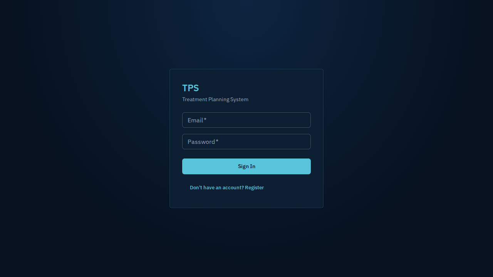
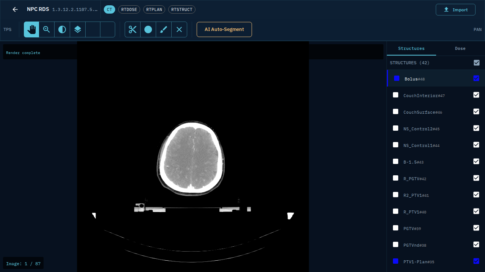

# my_tps_workspace

**Treatment Planning System (TPS)** - Browser/Server architecture for radiation therapy planning.

## Overview

A web-based medical imaging application for viewing and manipulating DICOM data, specifically designed for radiation therapy workflows including CT image visualization, RT Structure contouring, and RT Dose display.

## Tech Stack

| Layer | Technology |
|-------|------------|
| Frontend | React 18, Vite, MUI 5, Cornerstone3D 4.x |
| Backend | Express.js, better-sqlite3, dcmjs |
| Database | SQLite |
| Auth | JWT + HMAC-signed URLs |

## Project Structure

```
my_tps_workspace/           # Main application
├── backend/                 # Express.js API server
│   ├── src/
│   │   ├── index.js         # Entry point
│   │   ├── routes/          # API routes (auth, patients, studies, files, rtstruct, rtdose, contouring)
│   │   ├── services/        # Business logic
│   │   ├── middleware/      # Auth, upload, validation
│   │   ├── db/             # SQLite schema and initialization
│   │   └── logging/        # Winston logger
│   ├── uploads/            # Uploaded DICOM files
│   └── data/               # SQLite database
└── frontend/               # React SPA
    ├── src/
    │   ├── components/     # ViewerViewport, RTStructureOverlay, StructurePanel, DosePanel
    │   ├── pages/          # PatientListPage, StudyViewerPage
    │   ├── hooks/          # useRTContours, useDicomLoader, useRTDose
    │   └── lib/            # DICOM utilities
    └── index.html
```

## Getting Started

### Prerequisites

- Node.js >= 20
- npm

### Installation

```bash
cd my_tps_workspace
npm install
```

### Development

```bash
# Start both backend and frontend
npm run dev

# Or separately:
npm run dev:backend  # http://localhost:3001
npm run dev:frontend # http://localhost:5173
```

### Environment Setup

```bash
cp backend/.env.example backend/.env
# Edit backend/.env with your secrets
```

| Variable | Required | Description |
|----------|----------|-------------|
| `JWT_SECRET` | Yes | JWT signing secret |
| `HMAC_SECRET` | Yes | File download URL signing |
| `PORT` | No | Backend port (default: 3001) |

### Build

```bash
npm run build
```

## Features

### Phase 1 (Current)

- **DICOM Import**: Upload and parse DICOM files (CT, RTSTRUCT, RTDOSE)
- **Patient Management**: Create, browse, and associate patients with DICOM data
- **DICOM Visualization**: Display CT images with Cornerstone3D
- **RT Structure Overlay**: Render radiation therapy structure contours on CT
- **RT Dose Display**: Display dose distributions with color mapping
- **AI Auto-Segmentation**: Integration endpoint for organ contouring (Phase 4 ready)

### Screenshots

**Login Page**


**CT Viewer with RT Structure Overlays**


**Supported DICOM Types**

| Modality | Description | Tags |
|----------|-------------|------|
| CT | Computed Tomography | Image position, pixel spacing |
| RTSTRUCT | Radiation Therapy Structure Set | ROI contours, display colors |
| RTDOSE | Radiation Therapy Dose | Dose grid, accumulation |

## Key Components

### RTStructureOverlay

Renders RT Structure contours on Cornerstone viewport using DICOM Patient Coordinate System transformation:

```
World (mm) → Image Pixel → Canvas Pixel
```

### RT Dose Coordinate Transform

```
Dose → Patient (Dose→Patient matrix) → CT (invert CT→Patient matrix)
```

## Testing

```bash
# All tests
npm run test

# E2E tests (Playwright)
npm run test:e2e
```

## Reference Implementations

Do not modify these; they are for reference only:

- `test_module/RT-VIEWER-main/` - Lightweight React + Cornerstone RT viewer
- `test_module/Viewers-master/` - OHIF medical image viewer (enterprise)
- `src-doc/` - Orthanc DICOM server documentation

## Commands Reference

See [docs/COMMANDS.md](docs/COMMANDS.md) for full command reference.

## Environment Variables

See [docs/ENVIRONMENT.md](docs/ENVIRONMENT.md) for full environment variable reference.

## License

Private - All rights reserved
